# Markdown エディタ


日本語環境下で Markdown 文書を作成するための、簡易的なエディタです。

> [!WARNING]
> 本アプリは React の学習過程で作成したものです。そのため、機能的に不十分だったり、予期せぬ動作を起こす可能性があることを ご了承ください。

## 概要

本アプリはモバイル端末での利用を想定し、（全角文字を使用する）日本語環境下での、Markdown 文書作成を補助する目的で作成しました。

現在、下記の特徴を持っています。

- 各種 Markdown 要素は、ブロック単位で管理
- 作成した内容は `.md` ファイル またはクリップボードに出力可能
- 作成した内容は Web ページとして出力でき、ブラウザの機能を使い PDF として保存可能
- 編集内容自体を `.json` ファイルとして保存可能

また 本アプリは、デスクトップ及びモバイル端末にインストールすることが可能です。インストールすると、ホーム画面からアプリとして呼び出すことができます。

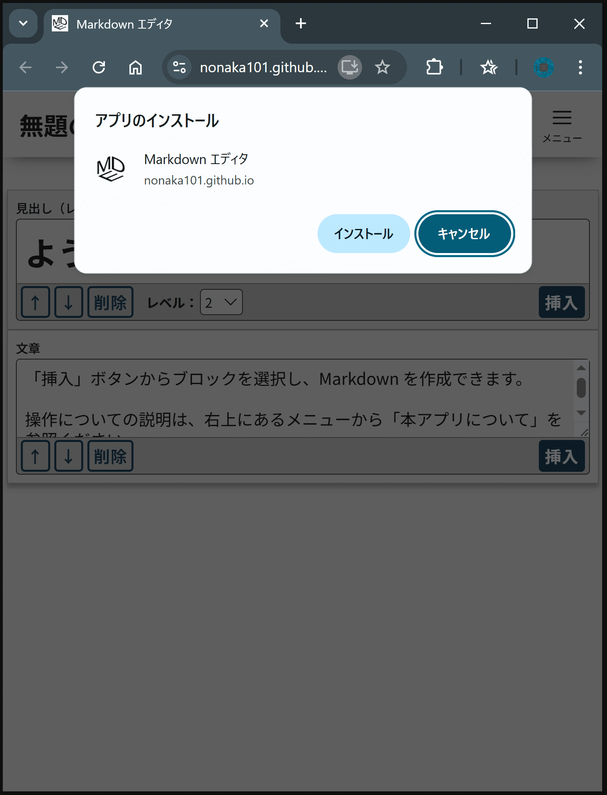

### 基本画面

基本的な画面は、下図のようになります。

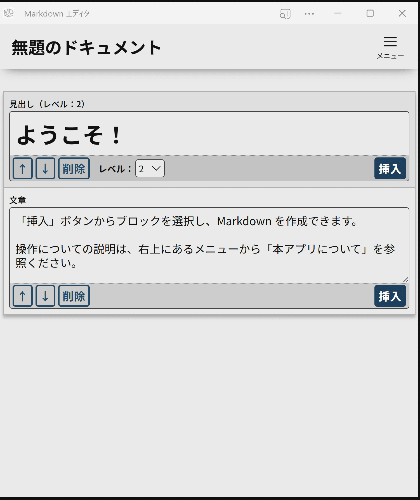

- 画面上部のヘッダーには、文書タイトルとメニューボタンが配置されています
- メインとなる部分では、文書内容をブロック単位で管理しています

### ブロックについて

本アプリでは、文書内容をブロック単位で管理しています。出力する際には、各ブロックに対応した markdown 要素として変換することになります。

基本的なブロックは、下記のような構造です。「↑」「↓」でブロックを上下に移動、「削除」でブロックを削除することができます。

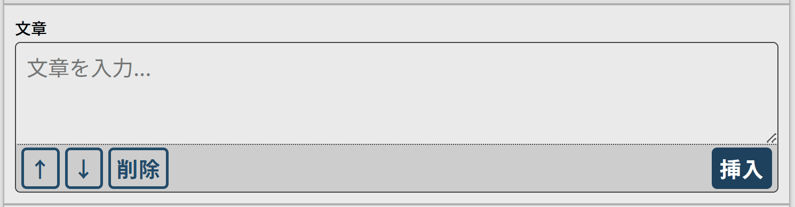

ブロック追加は、ブロック末尾の「挿入」ボタンから行います。ボタンを押すと、直下に挿入するブロックを指定するダイアログが表示されます。

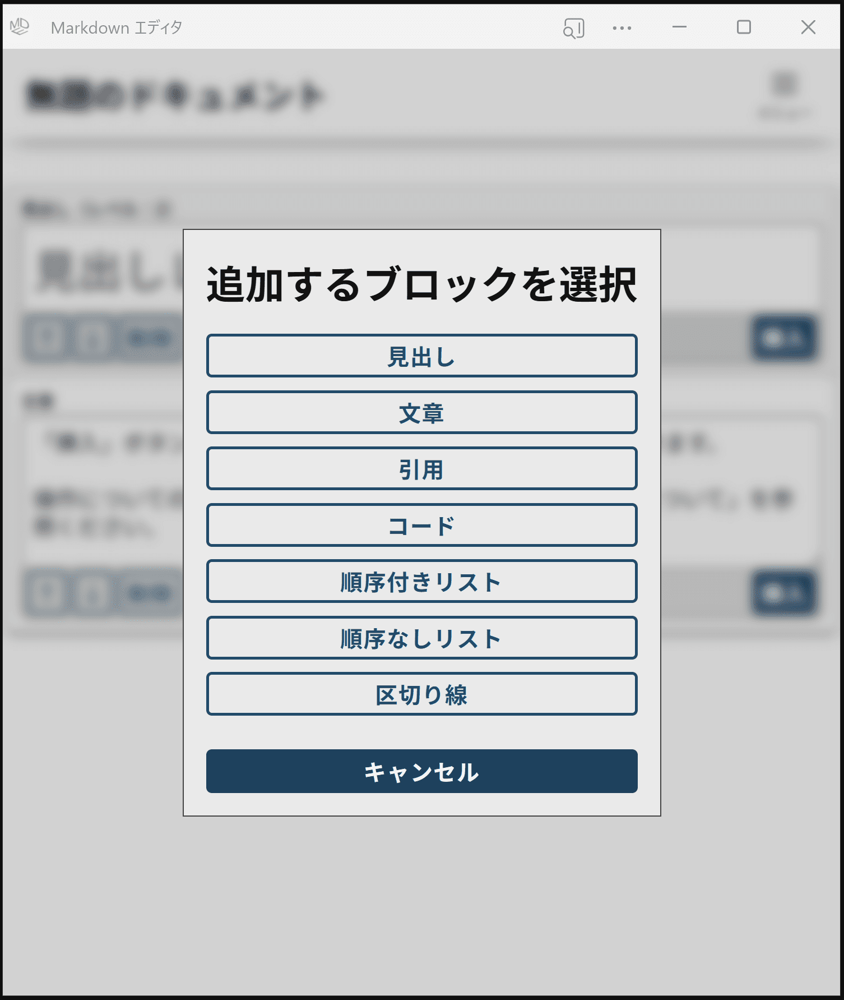

### 各種ブロックについて

ここでは、文書に挿入可能な各種ブロックを説明します。

#### 見出し

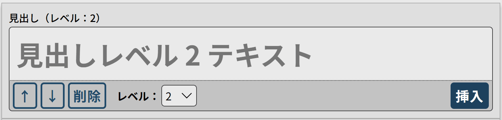

文章のタイトルや章立てを示すものです。

ブロック内にある「レベル」から、見出し構造を **2 〜 5** の範囲で調整することができます。

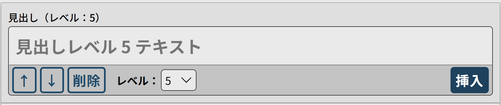

対応する markdown 文は、下記になります。

```md
## 見出しレベル２

### 見出しレベル３

#### 見出しレベル４

##### 見出しレベル５
```

> [!IMPORTANT]
> 見出しレベル１は、**文書内に 1 つのみ設定できる要素**としており、別の場所（[ドキュメント設定](#ドキュメント設定)）で設定します。

#### 文章関係

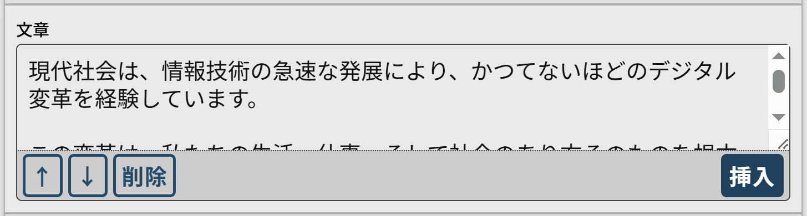

ここでは文章など、**複数行に渡って**作成できる要素を説明します。

なお、ここでの各種入力ボックスは、下記の方法で拡張できます。

- ボックス端に表示されているツマミから調整（デスクトップなど）
- ボックスをダブルクリックまたはダブルタップ（モバイル端末など）

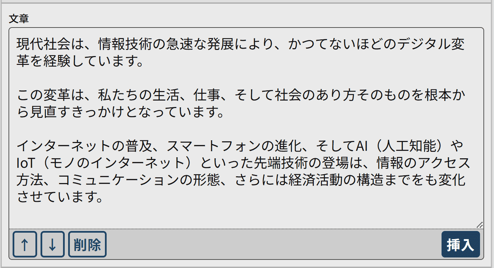

##### 文章


普通の文字で書かれる、一般的な文章のことです。なお、連続した改行 2 つで別段落として取り扱います。

対応する markdown 文は、下記になります。

```md
段落 1 の文章

段落 2 の文章
```

##### 引用

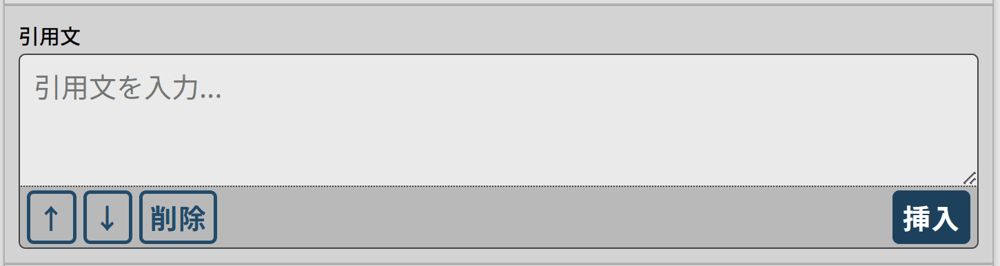

他者の言葉や文章を借りてきて表示するものです。なお、連続した改行 2 つで別段落として取り扱います。

対応する markdown 文は、下記になります。

```md
> 段落 1 の引用文
>
> 段落 2 の引用文
```

##### コード

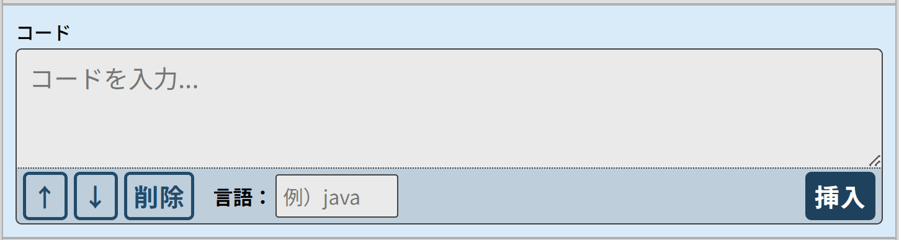

プログラムのソースコードやコマンドなどを そのまま表示するものです。

ブロック内にある「言語」から、プログラミング言語の名前を記述することもできます。ここでの設定は、下記の対応する markdown 文 `language名` の箇所で反映されます。

````md
```language名
コード本文
```
````

#### リスト関係

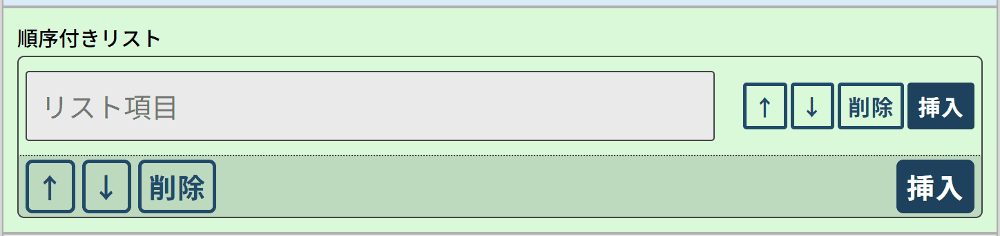

ここではリスト関係の要素について説明します。

> [!TIP]
> 内部の入力アイテムにフォーカスがある場合、下記のキー入力で特殊な操作が行えます。  
>
> - `Enter`：新規アイテムを挿入します
> - `Backspace`：アイテムを削除します（入力が空の状態の時）

##### 順序付きリスト

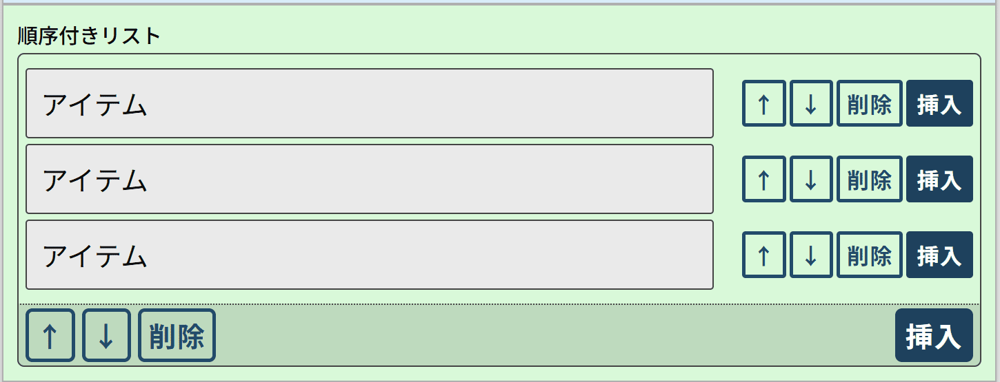

数字を使って、*順番に意味のある* 項目を並べるものです。

対応する markdown 文は、下記になります。

```md
1. アイテム
2. アイテム
3. アイテム
```

##### 順序なしリスト

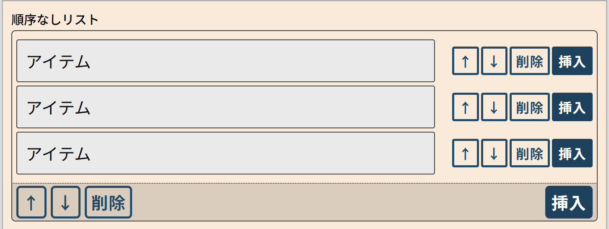

点や記号を使って、*順番に関係なく* 項目を並べるものです。

対応する markdown 文は、下記になります。

```md
- アイテム
- アイテム
- アイテム
```

#### 区切り線

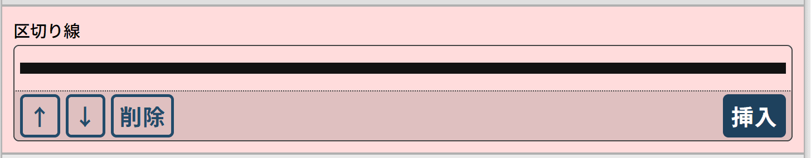

話題を変えるときなどに、水平な線で文章を区切るものです。

対応する markdown 文は、下記になります。

```md
---
```

### メニュー

ここでは、「メニュー」ダイアログの機能を説明します。このダイアログは、基本画面のヘッダーにある「メニュー」ボタンから呼び出すことができます。

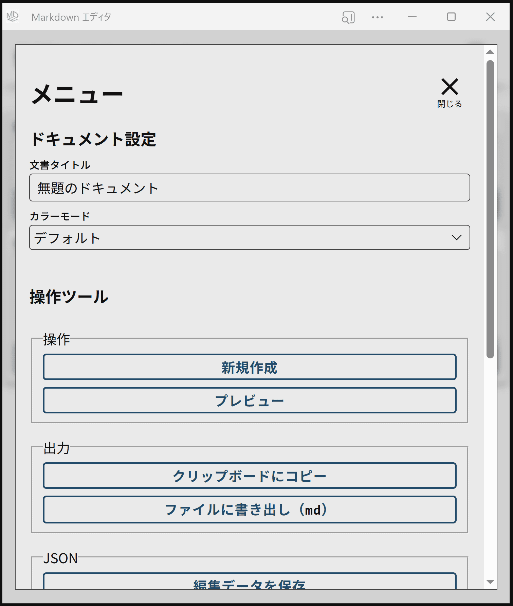

#### ドキュメント設定

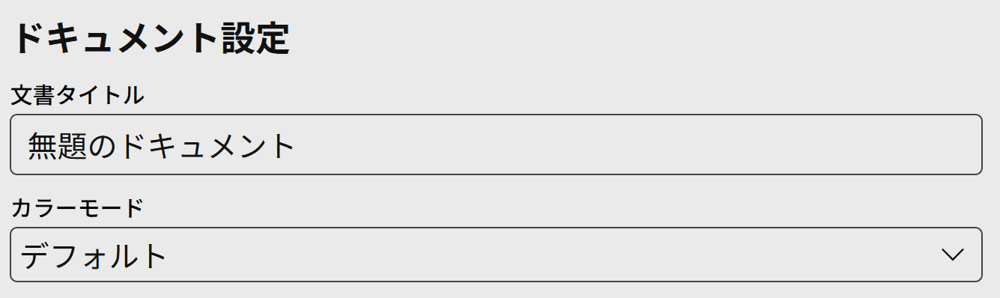

エディタ全体にかかる内容を取り扱います。ここでは 2 つの設定項目があります。

1. 文書タイトル
2. カラーモード

##### 文書タイトル

文書のタイトルとなる文を設定します。

ここで設定された内容は、*エディタ画面上部のタイトル要素* や *Markdown 文での見出しレベル１* に利用されます。

##### カラーモード

「ライト」「ダーク」間でカラーモードを切り替えることができます。

> [!TIP]
> 「デフォルト」では、デバイス内で設定されているカラーモードを参照し、自動的に切り替えます。

#### 操作ツール

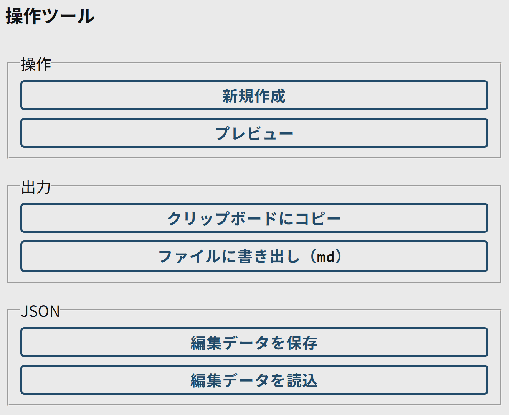

文書に対して各種操作をすることができます。ここでは 6 つの操作ボタンがあります。

- 新規作成
- プレビュー
- クリップボードにコピー
- ファイルとして保存
- 編集データを保存
- 編集データを読込

##### 新規作成

既存のデータを消去し、新規に文章を作成します。

> [!TIP]
> 新規作成で削除されるまで、文書はデバイス内に保存[^1]されます。

[^1]: データとしては JSON 形式で、`localStorage` 内に `markdownEditorContent` の名前で保存しています

##### プレビュー

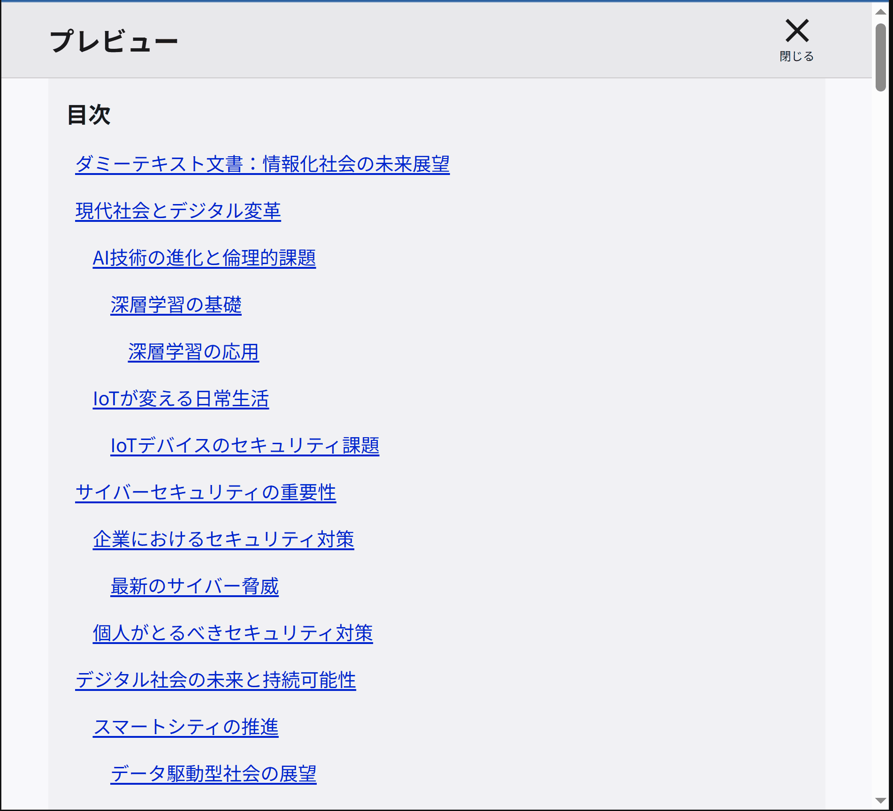

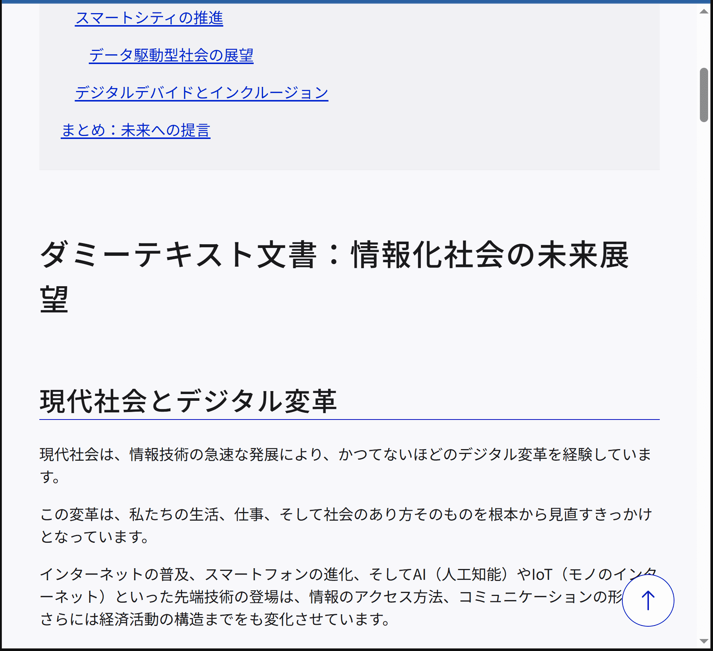

現在の編集内容を確認するために、内容を Web ページとして生成し表示します。

ブラウザに搭載されている印刷機能を使うことで、**PDF として出力**することも可能です。

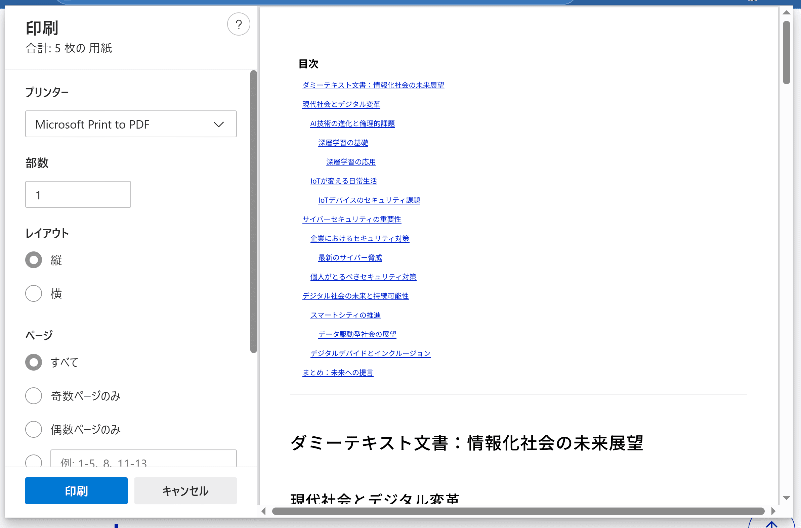

印刷時、一部の背景色が閲覧時と異なる場合があります。環境によっては、詳細設定「背景のグラフィックス」を有効化することで解決します。

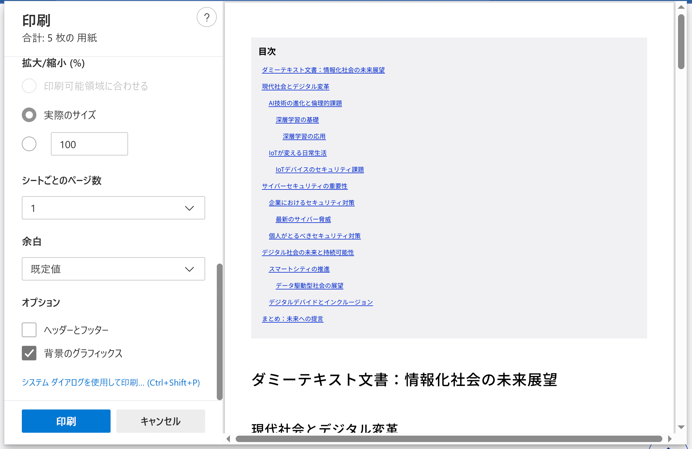

##### クリップボードにコピー

Markdown 形式に変換した文書を、クリップボードに格納します。

##### ファイルとして保存

Markdown 形式に変換した文書を、ファイルとして保存します（拡張子 `.md` ）

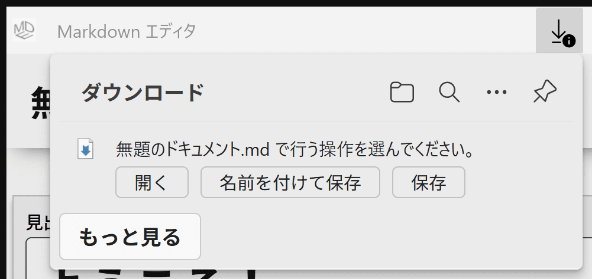

##### 編集データを保存

編集データ自体を、ファイルとして保存します。（拡張子 `.json` ）

Markdown 形式へ出力せず、編集内容自体を管理したい場合に使用します。

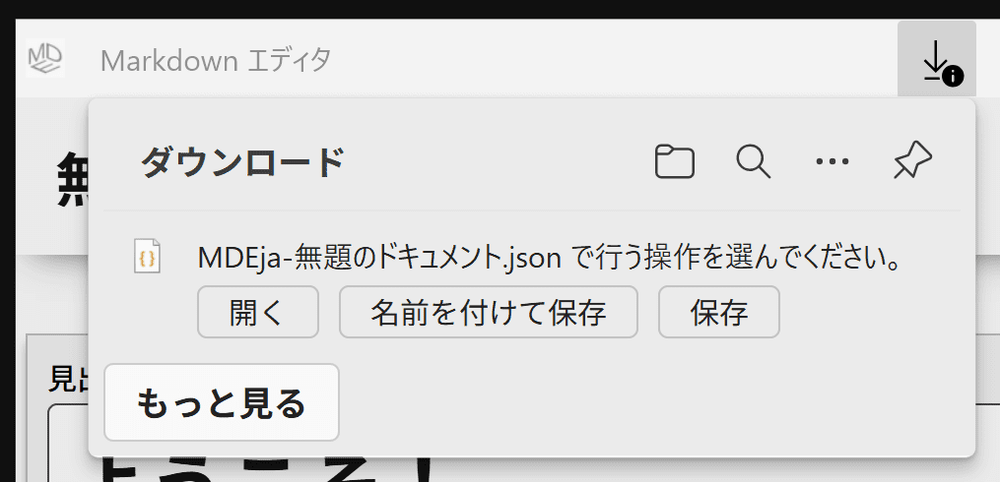

##### 編集データを読込

編集データを読み込み、内容を復元します。（拡張子 `.json` ）

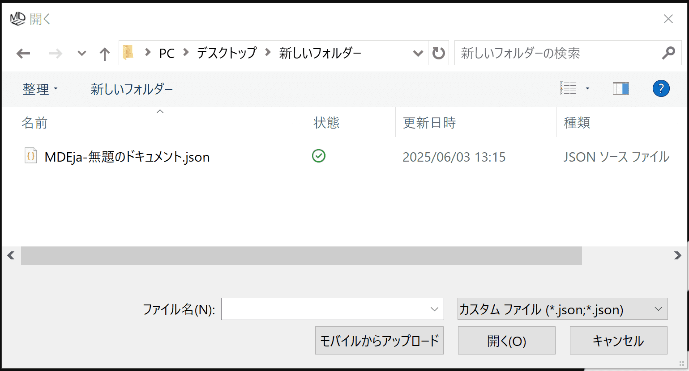

#### 見出しジャンプ

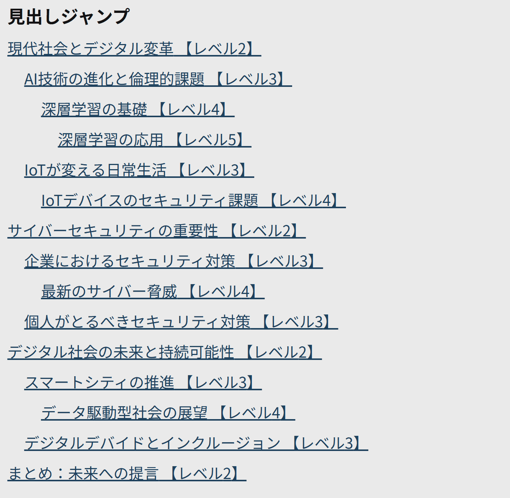

文書に「 [見出し](#見出し)構造」がある場合、一覧化された見出し要素が表示されます。

ここでの要素とブロックは紐づけされており、選択すると該当要素に移動することができます。

#### 本アプリについて

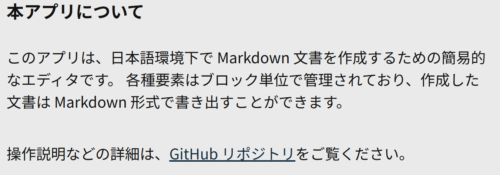

アプリについての簡単な説明が記されています。

### 注意事項

あくまで簡易的なエディタなので、例えば下記のような操作は行えません。

- リスト要素のネスト（リスト要素内に、サブリストを作成する）
- 下記の要素の作成補助（※自身で直接打ち込む分は可能です）
  - 強調（`*`, `**`）
  - リンク（`[リンク文](リンク先)`）
  - 画像（``）

### ライセンス

本リポジトリは [MIT ライセンス](./LICENSE) となっています。

また本リポジトリでは、各ブラウザ間のスタイル差をなくすため `normalize.css`（MIT ライセンス）を使用しています。

- [Normalize.css: Make browsers render all elements more consistently.](https://necolas.github.io/normalize.css/)
- [normalize.css/LICENSE.md at master · necolas/normalize.css · GitHub](https://github.com/necolas/normalize.css/blob/master/LICENSE.md)
